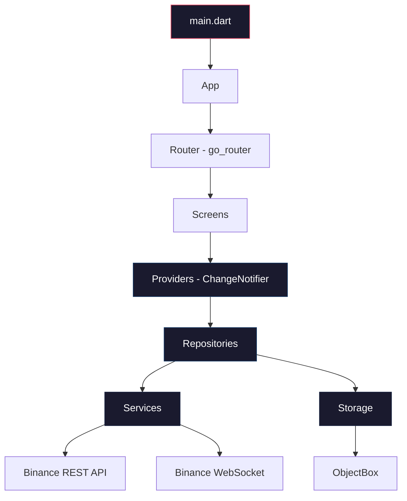
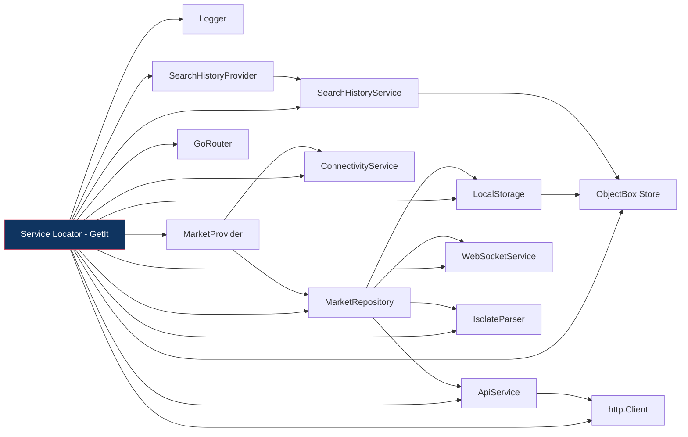
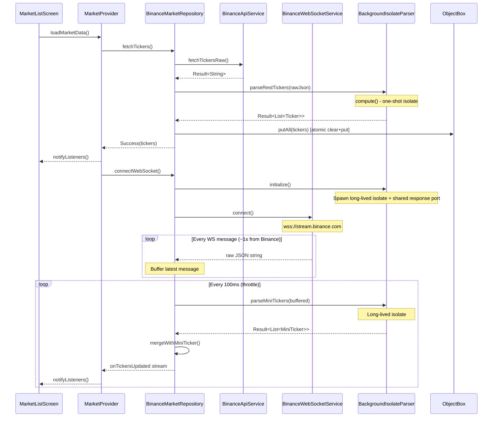
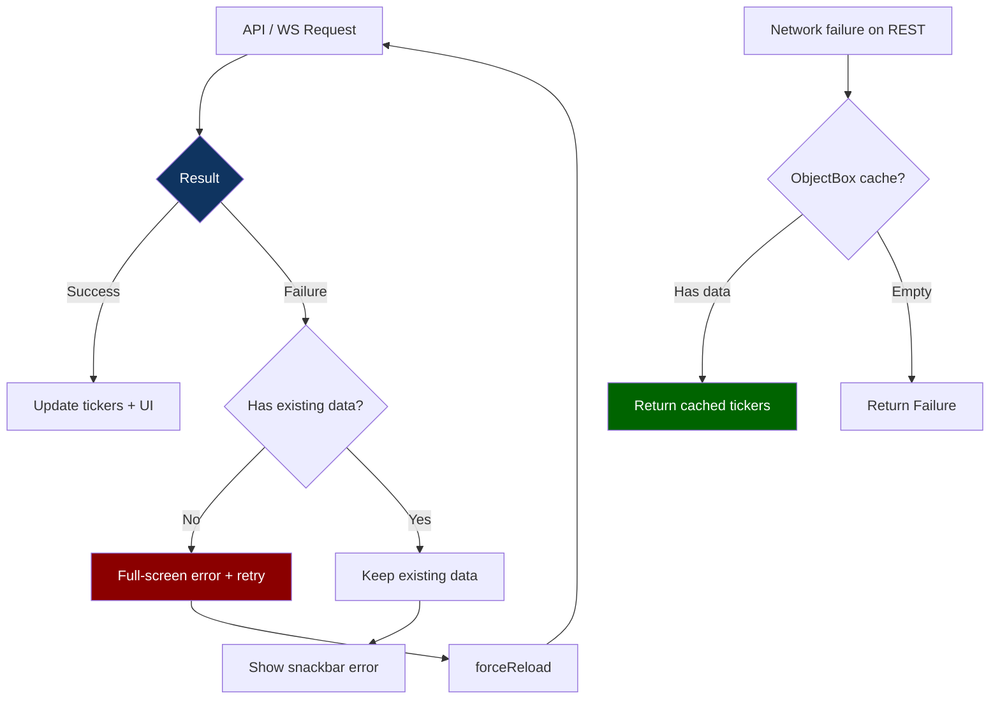
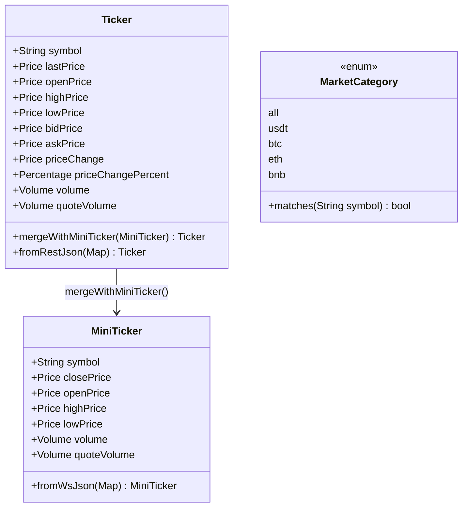
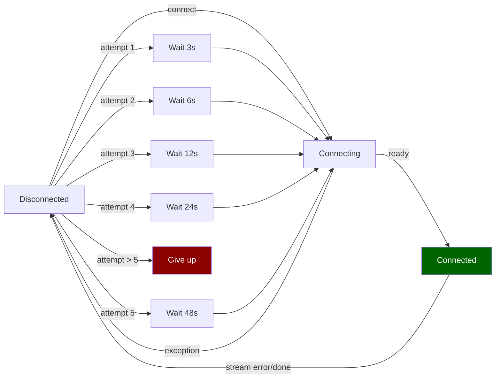
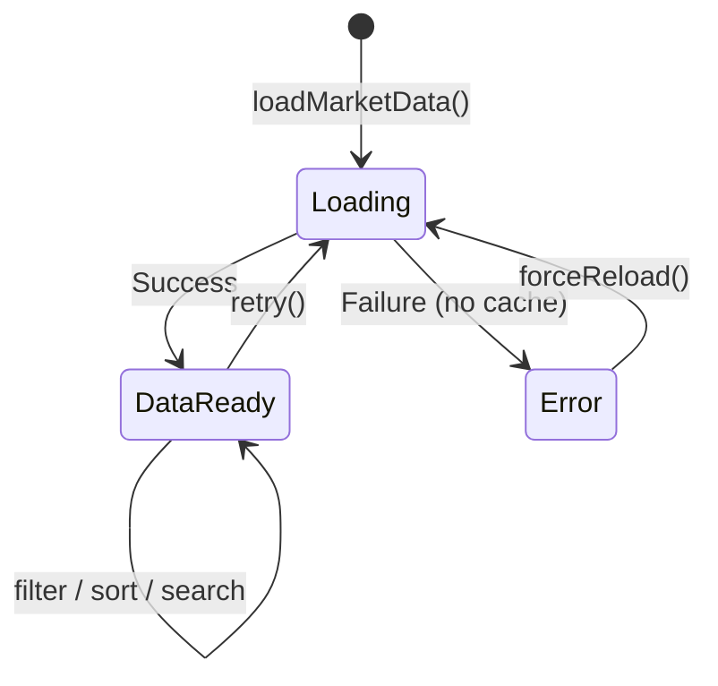
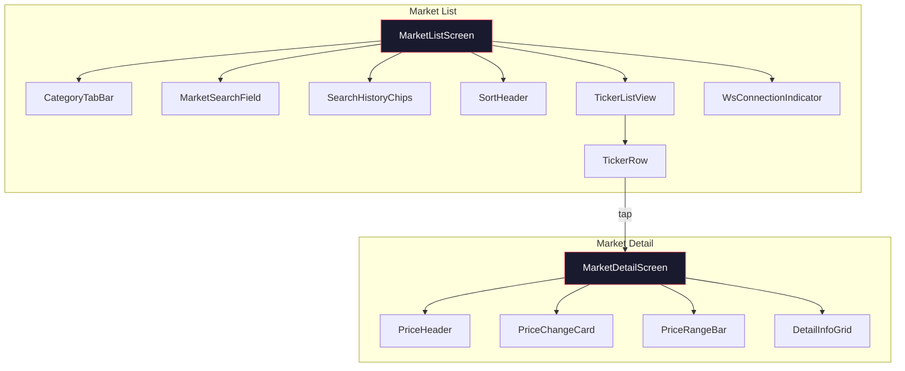
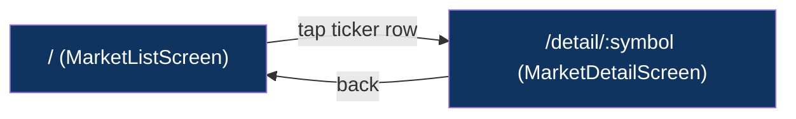
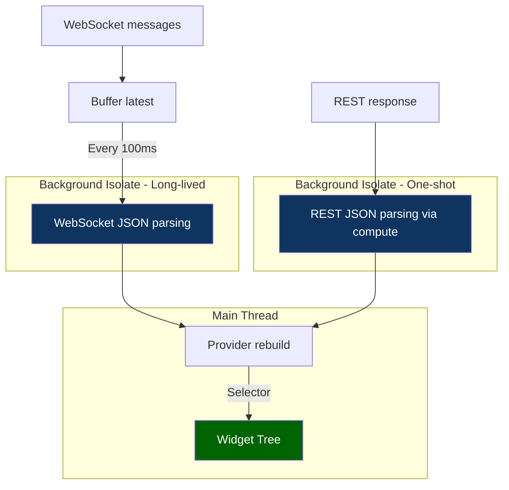

<div align="center">


<br>
<br>

<a href="https://drive.google.com/file/d/1PuhGJMp6L0IPxw5fbs09xRwF71sN7Lcm/view?usp=sharing">
  
</a>

</div>

## 🛠️ Tech Stack

<div align="center">


</div>


# CoinPulse: The Crypto Tracker & News Tracker

A real-time cryptocurrency market tracker built with Flutter. Streams live price data from the Binance API via WebSocket and displays 2,000+ trading pairs with category filtering, text search, multi-column sorting, and offline resilience. Extends the core market tracker with a personal **watchlist**, a curated **crypto news feed**, and a full **paper-trading portfolio** simulator with historical performance charting.

## Screenshots

| Market List | Search + Filter | Force Refresh | Market Detail |
| :-----------: | :---------------: | :------------: | :-------------: |
|  |  |  |  |
| All pairs with category tabs, sort headers, and live WS indicator | USDT category + "btc" text search filtering | Force to fetch fresh data | 24h change card, high/low range bar, statistics grid |

## How to Run

### Prerequisites

| Requirement | Version | Notes |
|-------------|---------|-------|
| Flutter | **3.38+** | Channel: stable |
| Dart | **3.10+** | Included with Flutter |
| Java | **17+** | Required for Android builds |
| Android SDK | **36+** | API 21+ (Android 5.0 Lollipop) minimum |
| iOS | **15.6+** | Xcode 15+ recommended |

### Setup

```bash
# Clone the repository
git clone https://github.com/deveminsahin/crypto_tracker.git
cd crypto_tracker

# Verify Flutter installation
flutter doctor

# Install dependencies
flutter pub get

# Generate ObjectBox model (required on first build)
dart run build_runner build

# iOS only: Install CocoaPods dependencies
cd ios && pod install && cd ..

# Run the app
flutter run
```

### Build APK (Release)

```bash
# Single APK (larger, universal)
flutter build apk --release

# Split per ABI (recommended, smaller)
flutter build apk --release --split-per-abi
```

### Profile Mode (Performance Verification)

```bash
flutter run --profile
```

## Tech Stack

| Category | Technology |
| ---------- | ----------- |
| Framework | Flutter (Dart 3.10+) |
| State Management | Provider (`ChangeNotifier` + `Selector`) |
| Navigation | go_router (declarative, deep-linkable, `StatefulShellRoute` for bottom-nav state preservation) |
| DI | GetIt (service locator) |
| Networking | `http` (REST), `web_socket_channel` (WebSocket) |
| Local Storage | ObjectBox (NoSQL) |
| Connectivity | connectivity_plus |
| Charts | fl_chart (portfolio value-over-time) |
| Image Caching | cached_network_image (news thumbnails) |
| External Links | url_launcher (open news articles in browser) |
| Localization | Flutter intl / ARB |

## Architecture

### Layer Diagram



The same layered approach extends to the new features: each feature has its own service (interface + implementation), provider, and screen, all registered through the same DI flow described below.

### Dependency Injection Flow



Registration order: `Logger` -> `Store` -> `http.Client` -> `Storage` -> `Services` -> `Repository` -> `Provider` -> `Router`.

The new feature dependencies are registered after the existing chain, in this order: `FavoritesService` (ObjectBox-backed) → `FavoritesProvider`; `NewsService` (CryptoCompare REST) → `NewsProvider`; `PortfolioService` (ObjectBox-backed, atomic transactions) → `PortfolioProvider` (which also listens to `MarketProvider` for live valuations).

### Data Flow



This same throttled WebSocket stream now feeds three downstream consumers in parallel: the Market screen, the Watchlist (filtered view of favorited symbols), and the Portfolio (which recomputes holdings valuations on every tick). Because all three read from the same `MarketProvider`, no additional WebSocket connections are opened.

### Error Handling Flow



The same two-tier error model is applied to news fetches (full-screen error if no articles cached, snackbar if a refresh fails over an existing list) and to trade execution (typed `InsufficientFundsException` / `InsufficientHoldingsException` surfaced inline in the trade sheet rather than crashing or producing generic toasts).

## Layers in Detail

### Core (`lib/core/`)

Foundation layer shared across the entire application.

- **Constants** - `ApiConstants` (endpoints, now including the CryptoCompare news base URL), `AppConstants` (durations, limits), `AppSizes` (spacing scale), `AppOpacity` (opacity tokens). All use `abstract final class` to prevent instantiation.
- **Errors** - `sealed class AppException` hierarchy: `NetworkException`, `ParseException`, `WebSocketException`, `StorageException`, plus the new domain-specific `InsufficientFundsException` and `InsufficientHoldingsException` raised by paper-trading operations. Each carries an optional `StackTrace` for debugging.
- **Result** - `sealed class Result<T>` with `Success<T>` and `Failure<T>`. Enables exhaustive pattern matching via Dart 3 switch expressions. Includes `map<R>()` for data transformation, `flatMap<R>()` for chaining `Result`-returning operations, and `when<R>()` for collapsing both branches.
- **Value Objects** - `Price`, `Percentage`, `Volume` - immutable, with formatted display (`$12,345.67`, `+2.45%`, `1.2B`), type-safe equality, and adaptive decimal precision. Reused throughout the new portfolio P/L computations to keep monetary values type-safe.
- **Theme** - Dark-only theme with `CryptoColors` `ThemeExtension` (priceUp, priceDown, priceNeutral, warning, onPriceBadge, shimmer base/highlight, flashIdle).

### Models (`lib/models/`)



- **Ticker** - Full 24h snapshot from REST, updated in-place via `mergeWithMiniTicker()`. Full-field equality for correct `Selector`-based UI diffing.
- **MiniTicker** - Lightweight WebSocket update (OHLCV only, no bid/ask). Annotated `@immutable`.
- **MarketCategory** - Enum with `matches(symbol)` strategy method for filtering by quote asset.

In addition to the core market models, four new immutable models support the new features:

- **NewsArticle** - Title, body preview, URL, image, source, published timestamp, and category list. Parsed via `NewsArticle.fromCryptoCompareJson()` in a background isolate.
- **NewsCategory** - Enum (`all`, `bitcoin`, `ethereum`, `trading`, `mining`, `regulation`, `defi`) with a `query` getter mapping to the API's category code.
- **Holding** - Runtime view that joins a stored `HoldingEntity` with the live `Ticker` to derive `currentValueUsd`, `unrealizedPnlUsd`, and `unrealizedPnlPercent` on every WebSocket tick. Pure read-only; never persisted.
- **PortfolioSummary** - Computed aggregate of cash + holdings, total return $, total return %, best/worst performer. Recomputed lazily when ticker data changes.

### Services (`lib/services/`)

Every service has an abstract interface for testability.

| Interface | Implementation | Responsibility |
| ----------- | --------------- | ---------------- |
| `ApiService` | `BinanceApiService` | REST `/api/v3/ticker/24hr` with 10s timeout |
| `WebSocketService` | `BinanceWebSocketService` | WSS `!miniTicker@arr` with exponential back-off, subscription tracking to prevent ghost listeners on reconnect |
| `IsolateParser` | `BackgroundIsolateParser` | Off-main-thread JSON parsing via shared response port with correlation IDs, concurrent-init guard, parse timeout |
| `ConnectivityService` | `ConnectivityServiceImpl` | Network reachability monitoring |
| `SearchHistoryService` | `ObjectBoxSearchHistoryService` | Recent search CRUD (max 4 entries), `StorageException` wrapping |
| `FavoritesService` | `ObjectBoxFavoritesService` | Favorite-symbol CRUD with reactive `watchAll()` stream backed by ObjectBox queries; `StorageException` wrapping |
| `NewsService` | `CryptoCompareNewsService` | CryptoCompare `/data/v2/news/` REST with 10s timeout, category filtering, off-thread JSON parsing via `compute()` |
| `PortfolioService` | `ObjectBoxPortfolioService` | Atomic buy/sell execution via `runInTransaction(TxMode.write)`, weighted-avg cost-basis tracking, trade history snapshots |

### WebSocket Reconnection Strategy



Exponential back-off formula: `base * 2^(n-1)` where base = 3 seconds, max 5 attempts.

### Repository (`lib/repositories/`)

`BinanceMarketRepository` orchestrates all data operations:

1. **REST Fetch** - Calls `ApiService`, parses via `IsolateParser`, populates in-memory `Map<String, Ticker>` cache, persists to ObjectBox via atomic clear-then-put transaction.
2. **Cache Fallback** - On network failure, loads tickers from ObjectBox for offline resilience. Stale entries (delisted pairs) are pruned on every cache write.
3. **WebSocket Streaming** - Subscribes to `WebSocketService`, buffers the latest message, flushes every 100ms via `Timer.periodic`, parses via long-lived isolate, merges updates into cache.
4. **Throttled UI Updates** - Only the most recent WS message per 100ms window is parsed. Binance's `!miniTicker@arr` stream updates every ~1000ms server-side, so this app updates faster than Binance's main page.

### Provider (`lib/providers/`)



**MarketProvider** manages:

- Ticker data map with cached `filteredTickers` (lazily computed via `??=`, invalidated at 7 mutation points)
- Category filtering (`MarketCategory` enum)
- Text search (symbol substring match)
- Multi-column sorting (symbol, price, change%, volume) with three-way cycle (none -> asc -> desc -> none)
- WebSocket connection state tracking
- Connectivity-aware reconnection: auto-reconnects when device comes back online, disconnects WebSocket when offline to prevent stale state
- Snackbar auto-dismiss: hides error snackbar when WebSocket reconnects successfully
- Two-tier error model: `_error` (full-screen, no data) vs `_refreshError` (snackbar, existing data preserved)
- Concurrency guards: `_isWsStarting` prevents duplicate WS sessions, `_isRetrying` prevents overlapping retries, `_isDisposed` + `_notify()` helper prevents post-dispose `notifyListeners` errors across all async callbacks

**SearchHistoryProvider** - Manages recent search terms (max 4) persisted to ObjectBox.

**FavoritesProvider** - Holds an in-memory `Set<String>` of favorited symbols for O(1) `contains()` lookups during list filtering. Subscribes to `FavoritesService.watchAll()` on init so any add/remove from anywhere in the app instantly updates every screen showing favorite state. Exposes `isFavorite(symbol)` and `toggle(symbol)` with `_isDisposed` and `_notify()` guards mirroring `MarketProvider`.

**NewsProvider** - Manages the news article list, currently selected `NewsCategory`, loading and error state, and the timestamp of the last successful fetch. Auto-refreshes every 5 minutes via `Timer.periodic`, but pauses while the app is in the background (via `WidgetsBindingObserver` + `AppLifecycleState`) to avoid unnecessary network usage. Concurrency-guarded so a manual pull-to-refresh during an in-flight auto-refresh doesn't double-fire.

**PortfolioProvider** - Holds the persisted `PortfolioEntity` (cash balance, initial balance), the list of `HoldingEntity` rows, and the most recent 20 `TradeEntity` records. Listens to `MarketProvider` via `addListener` so portfolio value, per-holding P/L, and the live performance card all update in real-time as prices stream in. Exposes `buy()` / `sell()` (both quantity-based and USD-amount-based, with quick-select percentages) and `resetPortfolio()`. Trade execution is concurrency-guarded by `_isExecutingTrade` to prevent double-spend on rapid taps.

### Screens (`lib/screens/`)



The original Market List → Market Detail flow above is now hosted inside a top-level bottom-navigation shell that exposes four tabs:

- **Market** - the unmodified `MarketListScreen` from above
- **Watchlist** - `WatchlistScreen` reuses `TickerListView` and `TickerRow` to render a live, filtered view of favorited symbols. The `TickerRow` widget gained a star toggle (wrapped in a `Selector<FavoritesProvider, bool>` so only that single row rebuilds on toggle, not the whole list) with a brief scale-pulse animation on tap. Empty state uses the existing `EmptyStateView` widget.
- **News** - `NewsScreen` shows a horizontal `CategoryTabBar`-style chip row, a `RefreshIndicator`-wrapped list of news cards (thumbnail via `cached_network_image`, title, source, relative time, category badges), a small "🔴 LIVE" indicator that fades out 60s after each refresh, and uses the existing `Shimmer` skeleton pattern for loading and `ErrorDisplay` for failures. Tapping a card opens the article in the external browser via `url_launcher`.
- **Portfolio** - `PortfolioScreen` shows an animated total-value header, a `fl_chart` `LineChart` of historical portfolio value (1D / 1W / 1M / ALL range chips), an allocation breakdown (cash + per-asset), the live holdings list with current price and unrealized P/L, recent trades, and a reset button in the overflow menu.

Two supporting screens sit on top of the Portfolio tab:

- **TradeScreen** - a modal bottom sheet reachable from `MarketDetailScreen` (via a "Trade" button) and from the holdings list. Buy/Sell toggle, quantity-or-USD input mode toggle, 25/50/75/100% quick-select chips, live preview of resulting cash and holding, "Paper trading — no fees" label, and inline error states for insufficient funds/holdings.
- **TradeHistoryScreen** - full chronological trade log with filtering by symbol and side.

A fifth screen, **AboutScreen**, is reachable from an info icon in the Market tab's app bar. It shows app metadata (via `package_info_plus`), the tech stack credits, a feature summary, a paper-trading disclaimer card, and acknowledgment of the upstream `crypto_tracker` repository. It is deliberately not a permanent bottom-nav slot.

### Navigation



go_router with declarative routes. Deep-linkable: `/` (list), `/detail/:symbol` (detail).

The router has been promoted to a `StatefulShellRoute.indexedStack` so each bottom-nav tab keeps its own scroll position and provider state across switches. Top-level routes are now `/market`, `/watchlist`, `/news`, `/portfolio`, with `/detail/:symbol`, `/trade/:symbol`, `/trade-history`, and `/about` pushing on top of the shell. The original deep links continue to work via redirect.

### Storage (`lib/storage/`)

ObjectBox NoSQL database with two entity types:

| Entity | Purpose | Fields |
| -------- | --------- | -------- |
| `TickerEntity` | Offline cache for REST tickers | symbol (unique), lastPrice, openPrice, highPrice, lowPrice, bidPrice, askPrice, priceChange, priceChangePercent, volume, quoteVolume |
| `SearchHistoryEntity` | Recent search terms | symbol (unique), searchedAt |

Four additional entities support the new features:

| Entity | Purpose | Fields |
| -------- | --------- | -------- |
| `FavoriteEntity` | Watchlist symbols | symbol (unique, indexed), addedAt |
| `PortfolioEntity` | Single-row cash + metadata | cashBalanceUsd, initialBalanceUsd, createdAt, updatedAt |
| `HoldingEntity` | One row per asset held | symbol (unique, indexed), quantity, avgCostBasisUsd, firstBoughtAt, updatedAt |
| `TradeEntity` | Immutable trade log | symbol (indexed), side (BUY/SELL), quantity, pricePerUnitUsd, totalUsd, executedAt, cashBalanceAfterUsd, portfolioValueAfterUsd |

`ObjectBoxTickerStorage.putAll` uses `Store.runInTransaction(TxMode.write, ...)` to atomically clear and repopulate, preventing stale entries from accumulating. The same atomic-transaction pattern is used in `ObjectBoxPortfolioService.executeBuy()` and `executeSell()` to ensure cash deduction, holding update, and trade-record insertion all succeed or all fail together — there is no partial-trade state. All ObjectBox operations are wrapped in `StorageException` to integrate with the sealed exception hierarchy.

### Widgets (`lib/widgets/`)

Shared reusable components:

- **Shimmer** - Ancestor-state pattern (`findAncestorStateOfType`) for coordinated shimmer animation across multiple children
- **TickerListSkeleton / TickerRowSkeleton** - Loading placeholders matching actual row layout
- **EmptyStateView** - Illustrated empty state for no search results
- **ErrorDisplay** - Full-screen error with localized message and retry button
- **WsConnectionIndicator** - Live pulsing dot showing WebSocket status
- **PulsingDot** - Animated dot (part of connection indicator)

These are reused without modification by the new screens. The `Shimmer` ancestor-state pattern in particular is leveraged on the news list during initial fetch, and `EmptyStateView` is reused across all three new screens (empty watchlist, no-results news category, and brand-new portfolio with no holdings).

## Performance



| Technique | Where | Why |
| ----------- | ------- | ----- |
| Background isolates | JSON parsing (REST + WS + News) | Keep main thread < 16ms frame budget |
| Long-lived isolate + shared response port | WebSocket stream parsing | Avoid per-message spawn and `ReceivePort` overhead; correlation IDs route responses |
| `compute()` | REST response parsing (tickers + news articles) | One-shot, no keep-alive needed |
| WS throttle (100ms) | Repository buffer + Timer | Cap UI updates at ~10/sec; Binance sends ~1/sec |
| `Selector<T, R>` | Screens (including the new star toggle on each ticker row) | Granular rebuilds (only on relevant state change) |
| `RepaintBoundary` (implicit) | Ticker rows via `ListView.builder` | ListView's built-in per-item boundaries isolate paint regions |
| `ListView.builder` + `itemExtent` | Ticker list (Market + Watchlist) | Fixed-height virtualized scrolling |
| `addAutomaticKeepAlives: false` | Ticker list, news list, holdings list | Reduce off-screen widget memory |
| `const` constructors | All widgets | Compile-time widget reuse |
| Cached `filteredTickers` | MarketProvider | Lazy `??=` with invalidation, avoids redundant filter/sort on every access |
| `Set<String>` for favorites | FavoritesProvider | O(1) membership check during watchlist filtering |
| Lazy `PortfolioSummary` recomputation | PortfolioProvider | Only recomputed when ticker data or holdings change, not on every UI build |
| `StatefulShellRoute.indexedStack` | Bottom navigation | Each tab keeps its widget tree alive; switching is free of rebuilds |
| `cached_network_image` | News thumbnails | Memory + disk caching prevents re-downloading on scroll |
| Background-aware auto-refresh | NewsProvider | Pauses 5-minute refresh timer when app is not in foreground |
| Full-field equality | Ticker model | Skip rebuild when no datum has changed |

## Security

- HTTPS only for REST API calls (`https://api.binance.com`, `https://min-api.cryptocompare.com`)
- WSS only for WebSocket streams (`wss://stream.binance.com:9443`)
- No API keys required (Binance public market data, CryptoCompare public news endpoint)
- No sensitive data stored locally (only public market prices, favorited symbols, and virtual paper-trading state)
- Error messages sanitized (no internal details leaked to UI)
- Paper trading is fully virtual and stored only on-device — no real funds, no broker integration, no transmission of trade data
- External news links open via `LaunchMode.externalApplication` to keep an embedded WebView out of the app's trust boundary
- No user data collected or transmitted

## Project Structure

```text
lib/
  main.dart                          # Entry point
  bootstrap.dart                     # Global error handling + DI init
  app/
    app.dart                         # Root MaterialApp widget + MultiProvider
  core/
    constants/
      api_constants.dart             # REST + WS + News endpoint URLs
      app_constants.dart             # Durations, limits
      app_opacity.dart               # Opacity tokens
      app_sizes.dart                 # Spacing scale
    di/
      service_locator.dart           # GetIt DI setup + teardown
    errors/
      app_exception.dart             # Sealed exception hierarchy (incl. trading exceptions)
    result/
      result.dart                    # Result<T> sealed union
    theme/
      app_theme.dart                 # Dark theme + CryptoColors
    logging/
      app_logger.dart                # AppLogger implementation
      logger.dart                    # Logger interface + LogLevel enum
    value_objects/
      numeric_value.dart             # Abstract NumericValue base
      percentage.dart                # Immutable percentage
      price.dart                     # Immutable price
      volume.dart                    # Immutable volume
  l10n/
    app_en.arb                       # English translations (incl. new feature strings)
    app_localizations.dart           # Generated
    app_localizations_en.dart        # Generated
    l10n_extension.dart              # AppLocalizationsX context extension
  models/
    market_category.dart             # Quote-asset filter enum
    mini_ticker.dart                 # WebSocket update model
    ticker.dart                      # Full 24h ticker model
    news_article.dart                # CryptoCompare news model
    news_category.dart               # News filter enum
    holding.dart                     # Runtime holding view (entity + live ticker)
    portfolio_summary.dart           # Aggregate portfolio metrics
  providers/
    market_provider.dart             # Market state + filtering
    search_history_provider.dart     # Search history state
    favorites_provider.dart          # Watchlist state (reactive, ObjectBox-backed)
    news_provider.dart               # News list + category + auto-refresh
    portfolio_provider.dart          # Cash + holdings + trades + live valuation
  repositories/
    market_repository.dart           # Abstract interface
    binance_market_repository.dart   # Binance implementation
  router/
    app_router.dart                  # go_router StatefulShellRoute setup
    app_navigation_observer.dart     # Navigation event logging
  screens/
    market_list/
      market_list_screen.dart        # Main list screen
      market_list_mixin.dart         # Non-UI behaviour mixin
      widgets/
        category_tab_bar.dart        # Category filter chips
        market_list_body.dart        # Body state orchestration
        market_search_field.dart     # Search input
        search_history_chips.dart    # Recent search chips
        sort_header.dart             # Sortable column headers
        ticker_list_view.dart        # Virtualized ticker list
        ticker_row.dart              # Single ticker row (now with favorite star)
        ticker_row_mixin.dart        # Flash animation mixin
    market_detail/
      market_detail_screen.dart      # Detail screen (now with Trade button + holding card)
      widgets/
        detail_info_grid.dart        # Statistics grid
        info_row.dart                # Label-value row widget
        price_change_card.dart       # 24h change badge
        price_header.dart            # Symbol + current price
        price_range_bar.dart         # High/low range bar
    watchlist/
      watchlist_screen.dart          # Favorited tickers, live updates
    news/
      news_screen.dart               # News feed with category chips
      widgets/
        news_card.dart               # Article card with thumbnail
        news_category_bar.dart       # Horizontal category chip row
    portfolio/
      portfolio_screen.dart          # Total value, chart, allocation, holdings
      trade_screen.dart              # Buy/Sell modal sheet
      trade_history_screen.dart      # Full trade log
      widgets/
        portfolio_value_header.dart  # Animated total-value card
        portfolio_chart.dart         # fl_chart LineChart with range selector
        allocation_bar.dart          # Cash + per-asset breakdown
        holding_row.dart             # Single holding with P/L
        trade_row.dart               # Single trade history entry
    about/
      about_screen.dart              # App metadata + credits + disclaimer
  shell/
    bottom_nav_shell.dart            # StatefulShellRoute host with NavigationBar
  services/
    api_service.dart                 # REST interface
    binance_api_service.dart         # Binance REST implementation
    websocket_service.dart           # WebSocket interface
    binance_websocket_service.dart   # Binance WS implementation
    websocket_config.dart            # WS configuration
    isolate_parser.dart              # Parser interface
    background_isolate_parser.dart   # Isolate implementation
    connectivity_service.dart        # Connectivity interface
    connectivity_service_impl.dart   # connectivity_plus impl
    search_history_service.dart     # Search history interface
    objectbox_search_history_service.dart # ObjectBox search history impl
    favorites_service.dart           # Favorites interface
    objectbox_favorites_service.dart # ObjectBox favorites impl
    news_service.dart                # News interface
    cryptocompare_news_service.dart  # CryptoCompare news impl
    portfolio_service.dart           # Portfolio interface
    objectbox_portfolio_service.dart # Atomic buy/sell, weighted-avg cost basis
  storage/
    local_storage.dart               # Storage interface
    objectbox_ticker_storage.dart    # ObjectBox implementation
    ticker_entity.dart               # Ticker DB entity
    search_history_entity.dart      # Search history DB entity
    favorite_entity.dart             # Watchlist DB entity
    portfolio_entity.dart            # Cash + metadata DB entity
    holding_entity.dart              # Per-asset position DB entity
    trade_entity.dart                # Immutable trade log DB entity
    objectbox-model.json             # ObjectBox schema
    objectbox.g.dart                 # Generated
  widgets/
    shimmer.dart                     # Shimmer animation
    ticker_list_skeleton.dart        # List skeleton loading
    ticker_row_skeleton.dart         # Row skeleton loading
    empty_state_view.dart            # Empty state
    error_display.dart               # Error state
    ws_connection_indicator.dart     # WS status dot
    pulsing_dot.dart                 # Animated dot
```

## Key Design Decisions

| Decision | Rationale |
| ---------- | ----------- |
| Sealed `Result<T>` over try-catch | Exhaustive handling at compile time; no uncaught exceptions leak |
| Value objects over raw `double` | Type safety, formatted output, encapsulated equality |
| Interface per service | Enables mock injection for testing; swappable implementations |
| Long-lived isolate + shared response port | Avoids ~2ms spawn cost per message and per-call `ReceivePort` allocation |
| WS buffer + throttle over raw stream | Prevents excessive rebuilds; Binance sends ~1 update/sec, app throttles at 100ms |
| ObjectBox over SharedPreferences | Structured queries, entity relationships, better performance for 2,000+ records |
| `Selector` over `watch` | Prevents full-tree rebuilds on unrelated state changes |
| Exponential back-off over linear | Industry standard; prevents server hammering during outages |
| `filteredTickers` caching | Avoids O(n) filter + sort on every `build()` call |
| Atomic clear+put for cache writes | `runInTransaction` prevents stale entries from accumulating after delistings |
| `StorageException` wrapping | All ObjectBox operations wrapped in the sealed exception hierarchy; prevents unhandled Future errors in `unawaited` callers |
| Concurrency guards in provider | `_isWsStarting`, `_isRetrying`, `_isDisposed` flags prevent duplicate WS sessions, overlapping retries, and post-dispose crashes under flaky networks |
| Atomic trade transactions | Buy/sell debits cash, mutates holding, and writes the trade record in a single `TxMode.write` transaction; impossible to land in a partial state where cash deducted but holding not updated |
| Weighted-average cost basis | Industry-standard accounting for unrealized P/L: `(oldQty * oldAvg + newQty * newPrice) / totalQty` on every buy; sells leave avg cost basis unchanged |
| Reactive favorites via ObjectBox `query.watch()` | Star toggle on Market screen instantly reflects on Watchlist with no manual provider plumbing |
| `StatefulShellRoute.indexedStack` for bottom nav | Each tab is a separate navigator with its own state; switching tabs never rebuilds or reloses scroll/data |
| Domain-typed exceptions for trading | `InsufficientFundsException` / `InsufficientHoldingsException` allow the trade sheet to render specific inline guidance instead of generic "something went wrong" toasts |
| Portfolio listens to MarketProvider, not its own WS | Single WebSocket connection drives every live-valued surface; no duplicated streams or extra Binance load |
| `LaunchMode.externalApplication` for news | Keeps third-party content out of the app's trust boundary; no in-app WebView attack surface |
| Background-aware news auto-refresh | Pausing the 5-min refresh timer when backgrounded saves battery and avoids stale stale data on resume |
