# Crypto Tracker

A real-time cryptocurrency market tracker built with Flutter. Streams live price data from the Binance API via WebSocket and displays 2,000+ trading pairs with category filtering, text search, multi-column sorting, and offline resilience.

## Screenshots

| Market List | Search + Filter | Force Refresh | Market Detail |
| :-----------: | :---------------: | :------------: | :-------------: |
| 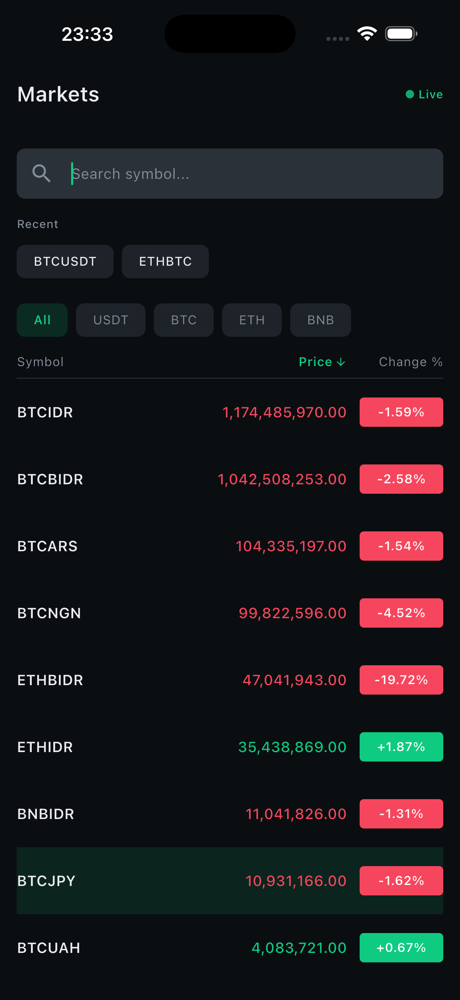 | 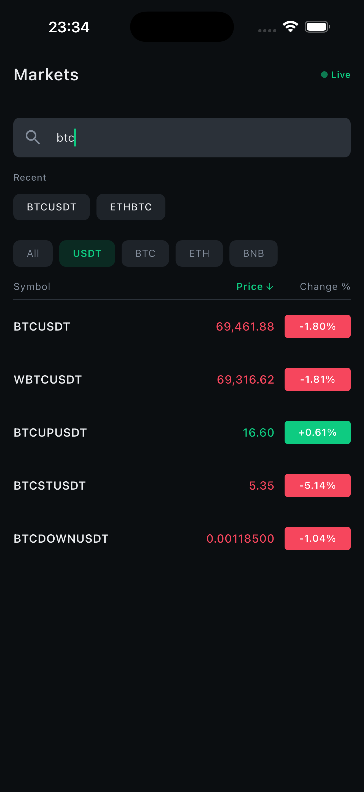 | 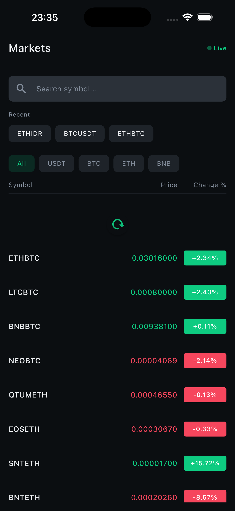 | 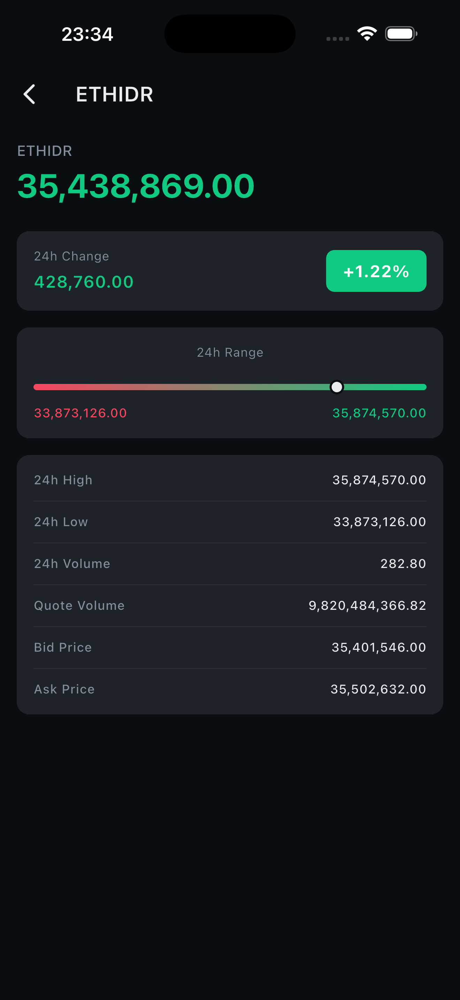 |
| All pairs with category tabs, sort headers, and live WS indicator | USDT category + "btc" text search filtering | Force to fetch fresh data | 24h change card, high/low range bar, statistics grid |

## How to Run

### Prerequisites

| Requirement | Version | Notes |
|-------------|---------|-------|
| Flutter | **3.38+** | Channel: stable |
| Dart | **3.10+** | Included with Flutter |
| Java | **17+** | Required for Android builds |
| Android SDK | **36+** | API 21+ (Android 5.0 Lollipop) minimum |
| iOS | **15.6+** | Xcode 15+ recommended |

### Setup

```bash
# Verify Flutter installation
flutter doctor

# Install dependencies
flutter pub get

# Generate ObjectBox model (required on first build)
dart run build_runner build

# iOS only: Install CocoaPods dependencies
cd ios && pod install && cd ..

# Run the app
flutter run
```

### Build APK (Release)

```bash
# Single APK (larger, universal)
flutter build apk --release

# Split per ABI (recommended, smaller)
flutter build apk --release --split-per-abi
```

### Profile Mode (Performance Verification)

```bash
flutter run --profile
```

## Tech Stack

| Category | Technology |
| ---------- | ----------- |
| Framework | Flutter (Dart 3.10+) |
| State Management | Provider (`ChangeNotifier` + `Selector`) |
| Navigation | go_router (declarative, deep-linkable) |
| DI | GetIt (service locator) |
| Networking | `http` (REST), `web_socket_channel` (WebSocket) |
| Local Storage | ObjectBox (NoSQL) |
| Connectivity | connectivity_plus |
| Localization | Flutter intl / ARB |

## Architecture

### Layer Diagram

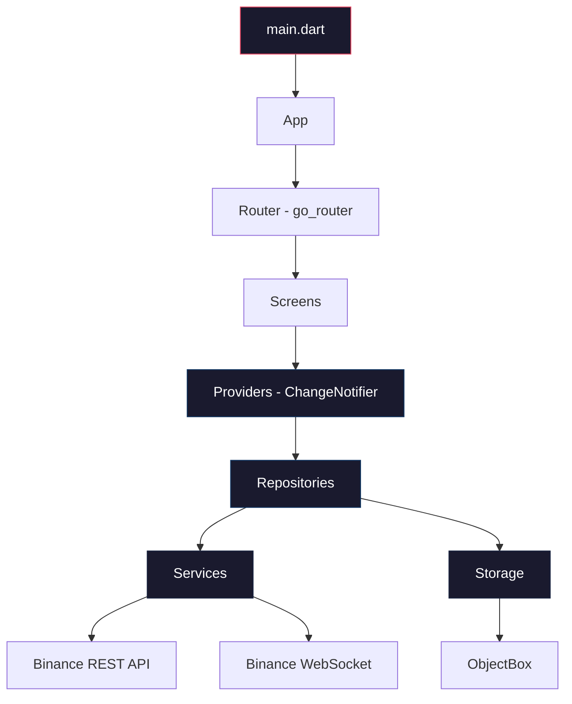

### Dependency Injection Flow

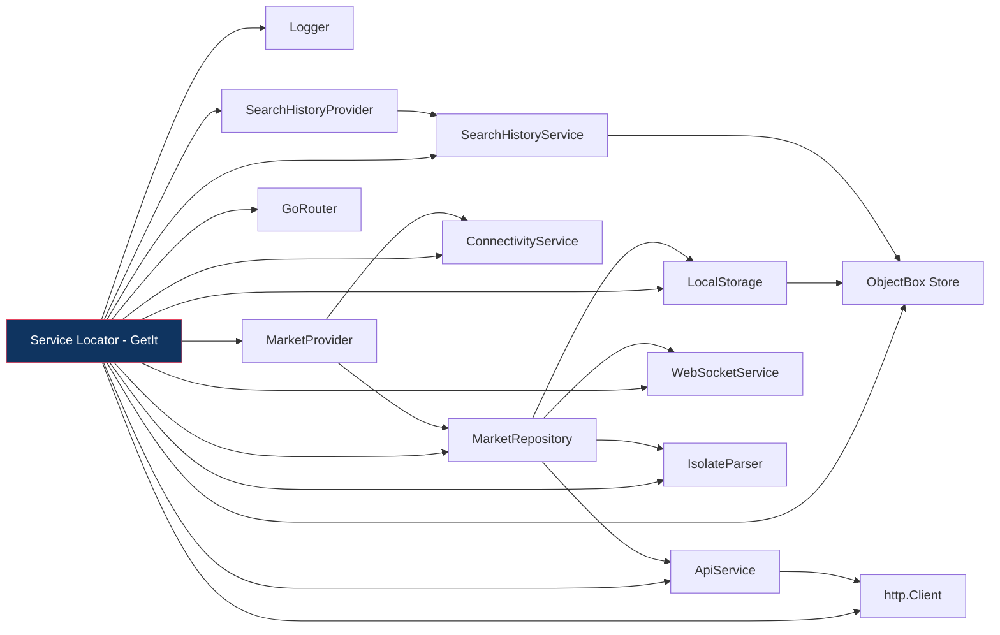

Registration order: `Logger` -> `Store` -> `http.Client` -> `Storage` -> `Services` -> `Repository` -> `Provider` -> `Router`.

### Data Flow

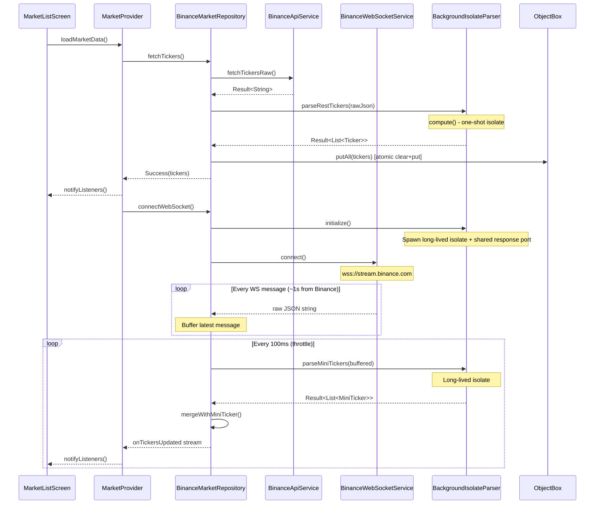

### Error Handling Flow

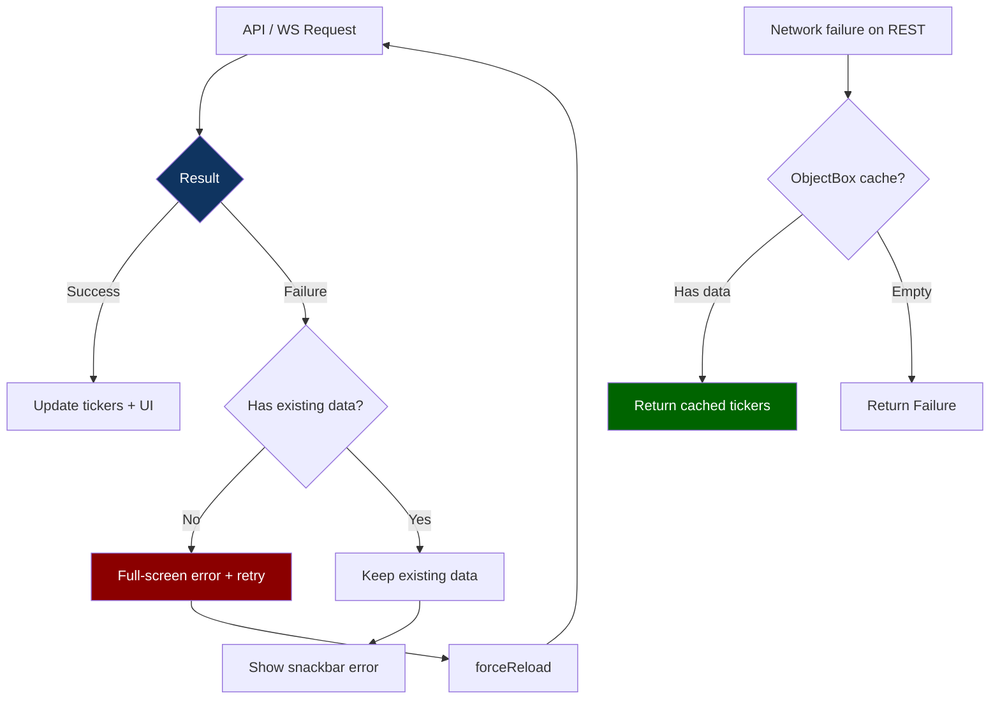

## Layers in Detail

### Core (`lib/core/`)

Foundation layer shared across the entire application.

- **Constants** - `ApiConstants` (endpoints), `AppConstants` (durations, limits), `AppSizes` (spacing scale), `AppOpacity` (opacity tokens). All use `abstract final class` to prevent instantiation.
- **Errors** - `sealed class AppException` hierarchy: `NetworkException`, `ParseException`, `WebSocketException`, `StorageException`. Each carries an optional `StackTrace` for debugging.
- **Result** - `sealed class Result<T>` with `Success<T>` and `Failure<T>`. Enables exhaustive pattern matching via Dart 3 switch expressions. Includes `map<R>()` for data transformation, `flatMap<R>()` for chaining `Result`-returning operations, and `when<R>()` for collapsing both branches.
- **Value Objects** - `Price`, `Percentage`, `Volume` - immutable, with formatted display (`$12,345.67`, `+2.45%`, `1.2B`), type-safe equality, and adaptive decimal precision.
- **Theme** - Dark-only theme with `CryptoColors` `ThemeExtension` (priceUp, priceDown, priceNeutral, warning, onPriceBadge, shimmer base/highlight, flashIdle).

### Models (`lib/models/`)

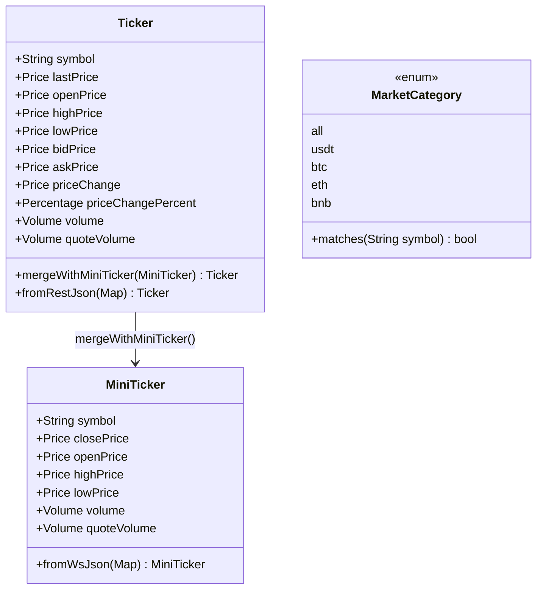

- **Ticker** - Full 24h snapshot from REST, updated in-place via `mergeWithMiniTicker()`. Full-field equality for correct `Selector`-based UI diffing.
- **MiniTicker** - Lightweight WebSocket update (OHLCV only, no bid/ask). Annotated `@immutable`.
- **MarketCategory** - Enum with `matches(symbol)` strategy method for filtering by quote asset.

### Services (`lib/services/`)

Every service has an abstract interface for testability.

| Interface | Implementation | Responsibility |
| ----------- | --------------- | ---------------- |
| `ApiService` | `BinanceApiService` | REST `/api/v3/ticker/24hr` with 10s timeout |
| `WebSocketService` | `BinanceWebSocketService` | WSS `!miniTicker@arr` with exponential back-off, subscription tracking to prevent ghost listeners on reconnect |
| `IsolateParser` | `BackgroundIsolateParser` | Off-main-thread JSON parsing via shared response port with correlation IDs, concurrent-init guard, parse timeout |
| `ConnectivityService` | `ConnectivityServiceImpl` | Network reachability monitoring |
| `SearchHistoryService` | `ObjectBoxSearchHistoryService` | Recent search CRUD (max 4 entries), `StorageException` wrapping |

### WebSocket Reconnection Strategy

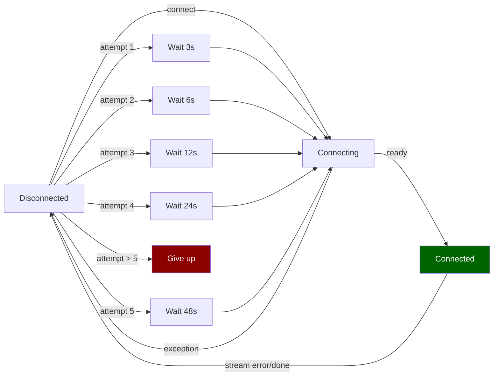

Exponential back-off formula: `base * 2^(n-1)` where base = 3 seconds, max 5 attempts.

### Repository (`lib/repositories/`)

`BinanceMarketRepository` orchestrates all data operations:

1. **REST Fetch** - Calls `ApiService`, parses via `IsolateParser`, populates in-memory `Map<String, Ticker>` cache, persists to ObjectBox via atomic clear-then-put transaction.
2. **Cache Fallback** - On network failure, loads tickers from ObjectBox for offline resilience. Stale entries (delisted pairs) are pruned on every cache write.
3. **WebSocket Streaming** - Subscribes to `WebSocketService`, buffers the latest message, flushes every 100ms via `Timer.periodic`, parses via long-lived isolate, merges updates into cache.
4. **Throttled UI Updates** - Only the most recent WS message per 100ms window is parsed. Binance's `!miniTicker@arr` stream updates every ~1000ms server-side, so this app updates faster than Binance's main page.

### Provider (`lib/providers/`)

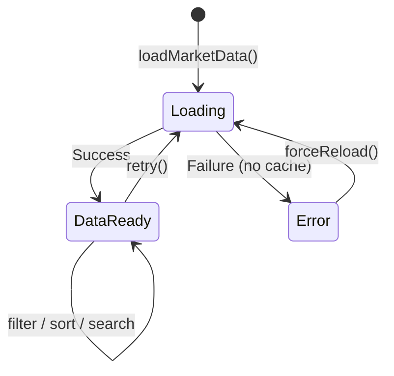

**MarketProvider** manages:

- Ticker data map with cached `filteredTickers` (lazily computed via `??=`, invalidated at 7 mutation points)
- Category filtering (`MarketCategory` enum)
- Text search (symbol substring match)
- Multi-column sorting (symbol, price, change%, volume) with three-way cycle (none -> asc -> desc -> none)
- WebSocket connection state tracking
- Connectivity-aware reconnection: auto-reconnects when device comes back online, disconnects WebSocket when offline to prevent stale state
- Snackbar auto-dismiss: hides error snackbar when WebSocket reconnects successfully
- Two-tier error model: `_error` (full-screen, no data) vs `_refreshError` (snackbar, existing data preserved)
- Concurrency guards: `_isWsStarting` prevents duplicate WS sessions, `_isRetrying` prevents overlapping retries, `_isDisposed` + `_notify()` helper prevents post-dispose `notifyListeners` errors across all async callbacks

**SearchHistoryProvider** - Manages recent search terms (max 4) persisted to ObjectBox.

### Screens (`lib/screens/`)

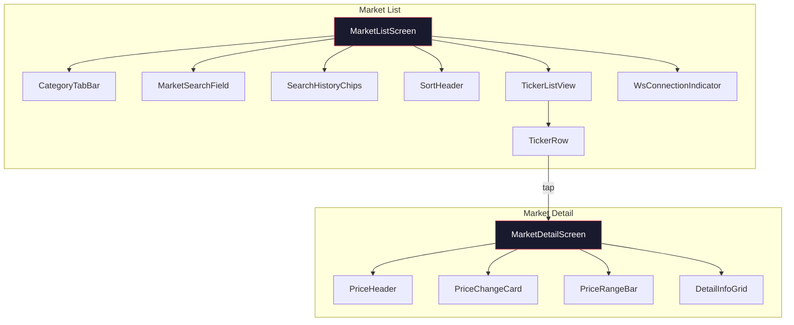

### Navigation

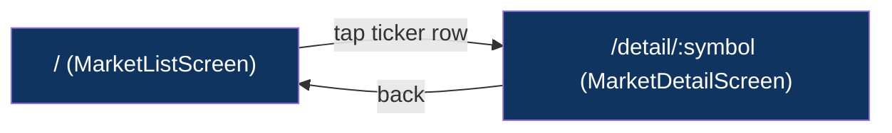

go_router with declarative routes. Deep-linkable: `/` (list), `/detail/:symbol` (detail).

### Storage (`lib/storage/`)

ObjectBox NoSQL database with two entity types:

| Entity | Purpose | Fields |
| -------- | --------- | -------- |
| `TickerEntity` | Offline cache for REST tickers | symbol (unique), lastPrice, openPrice, highPrice, lowPrice, bidPrice, askPrice, priceChange, priceChangePercent, volume, quoteVolume |
| `SearchHistoryEntity` | Recent search terms | symbol (unique), searchedAt |

`ObjectBoxTickerStorage.putAll` uses `Store.runInTransaction(TxMode.write, ...)` to atomically clear and repopulate, preventing stale entries from accumulating. All ObjectBox operations are wrapped in `StorageException` to integrate with the sealed exception hierarchy.

### Widgets (`lib/widgets/`)

Shared reusable components:

- **Shimmer** - Ancestor-state pattern (`findAncestorStateOfType`) for coordinated shimmer animation across multiple children
- **TickerListSkeleton / TickerRowSkeleton** - Loading placeholders matching actual row layout
- **EmptyStateView** - Illustrated empty state for no search results
- **ErrorDisplay** - Full-screen error with localized message and retry button
- **WsConnectionIndicator** - Live pulsing dot showing WebSocket status
- **PulsingDot** - Animated dot (part of connection indicator)

## Performance

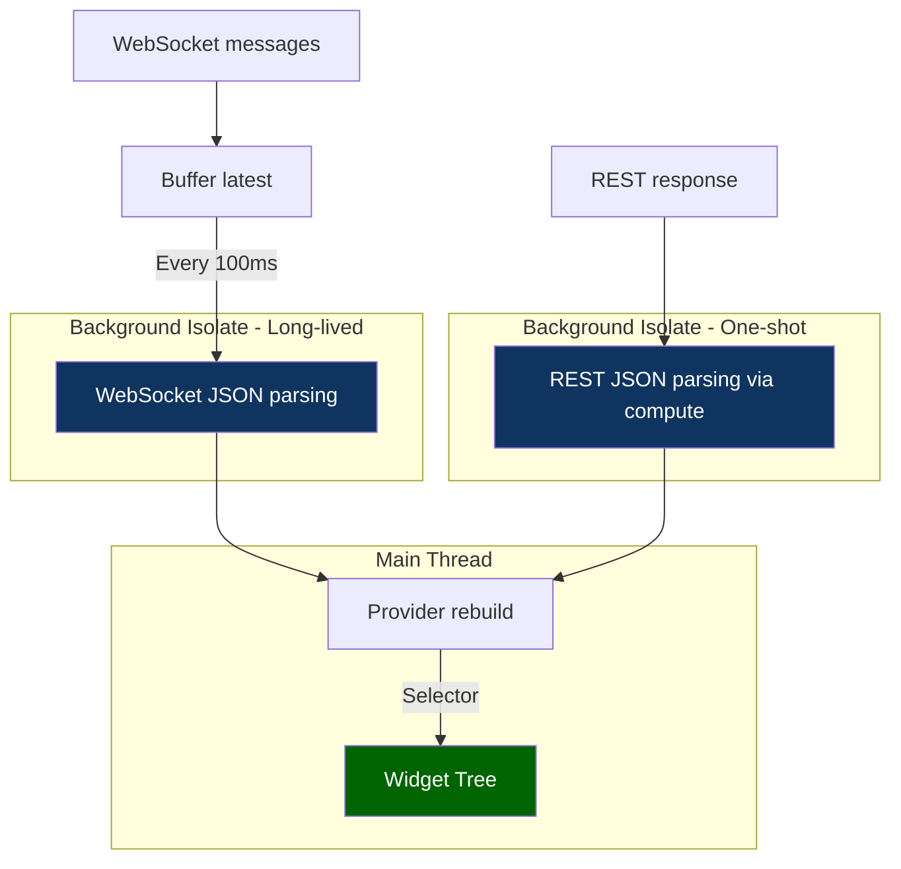

| Technique | Where | Why |
| ----------- | ------- | ----- |
| Background isolates | JSON parsing (REST + WS) | Keep main thread < 16ms frame budget |
| Long-lived isolate + shared response port | WebSocket stream parsing | Avoid per-message spawn and `ReceivePort` overhead; correlation IDs route responses |
| `compute()` | REST response parsing | One-shot, no keep-alive needed |
| WS throttle (100ms) | Repository buffer + Timer | Cap UI updates at ~10/sec; Binance sends ~1/sec |
| `Selector<T, R>` | Screens | Granular rebuilds (only on relevant state change) |
| `RepaintBoundary` (implicit) | Ticker rows via `ListView.builder` | ListView's built-in per-item boundaries isolate paint regions |
| `ListView.builder` + `itemExtent` | Ticker list | Fixed-height virtualized scrolling |
| `addAutomaticKeepAlives: false` | Ticker list | Reduce off-screen widget memory |
| `const` constructors | All widgets | Compile-time widget reuse |
| Cached `filteredTickers` | MarketProvider | Lazy `??=` with invalidation, avoids redundant filter/sort on every access |
| Full-field equality | Ticker model | Skip rebuild when no datum has changed |

## Security

- HTTPS only for REST API calls (`https://api.binance.com`)
- WSS only for WebSocket streams (`wss://stream.binance.com:9443`)
- No API keys required (Binance public market data)
- No sensitive data stored locally (only public market prices)
- Error messages sanitized (no internal details leaked to UI)
- No user data collected or transmitted

## Project Structure

```text
lib/
  main.dart                          # Entry point
  bootstrap.dart                     # Global error handling + DI init
  app/
    app.dart                         # Root MaterialApp widget
  core/
    constants/
      api_constants.dart             # REST + WS endpoint URLs
      app_constants.dart             # Durations, limits
      app_opacity.dart               # Opacity tokens
      app_sizes.dart                 # Spacing scale
    di/
      service_locator.dart           # GetIt DI setup + teardown
    errors/
      app_exception.dart             # Sealed exception hierarchy
    result/
      result.dart                    # Result<T> sealed union
    theme/
      app_theme.dart                 # Dark theme + CryptoColors
    logging/
      app_logger.dart                # AppLogger implementation
      logger.dart                    # Logger interface + LogLevel enum
    value_objects/
      numeric_value.dart             # Abstract NumericValue base
      percentage.dart                # Immutable percentage
      price.dart                     # Immutable price
      volume.dart                    # Immutable volume
  l10n/
    app_en.arb                       # English translations
    app_localizations.dart           # Generated
    app_localizations_en.dart        # Generated
    l10n_extension.dart              # AppLocalizationsX context extension
  models/
    market_category.dart             # Quote-asset filter enum
    mini_ticker.dart                 # WebSocket update model
    ticker.dart                      # Full 24h ticker model
  providers/
    market_provider.dart             # Market state + filtering
    search_history_provider.dart     # Search history state
  repositories/
    market_repository.dart           # Abstract interface
    binance_market_repository.dart   # Binance implementation
  router/
    app_router.dart                  # go_router setup
    app_navigation_observer.dart     # Navigation event logging
  screens/
    market_list/
      market_list_screen.dart        # Main list screen
      market_list_mixin.dart         # Non-UI behaviour mixin
      widgets/
        category_tab_bar.dart        # Category filter chips
        market_list_body.dart        # Body state orchestration
        market_search_field.dart     # Search input
        search_history_chips.dart    # Recent search chips
        sort_header.dart             # Sortable column headers
        ticker_list_view.dart        # Virtualized ticker list
        ticker_row.dart              # Single ticker row
        ticker_row_mixin.dart        # Flash animation mixin
    market_detail/
      market_detail_screen.dart      # Detail screen
      widgets/
        detail_info_grid.dart        # Statistics grid
        info_row.dart                # Label-value row widget
        price_change_card.dart       # 24h change badge
        price_header.dart            # Symbol + current price
        price_range_bar.dart         # High/low range bar
  services/
    api_service.dart                 # REST interface
    binance_api_service.dart         # Binance REST implementation
    websocket_service.dart           # WebSocket interface
    binance_websocket_service.dart   # Binance WS implementation
    websocket_config.dart            # WS configuration
    isolate_parser.dart              # Parser interface
    background_isolate_parser.dart   # Isolate implementation
    connectivity_service.dart        # Connectivity interface
    connectivity_service_impl.dart   # connectivity_plus impl
    search_history_service.dart      # Search history interface
    objectbox_search_history_service.dart # ObjectBox search history impl
  storage/
    local_storage.dart               # Storage interface
    objectbox_ticker_storage.dart    # ObjectBox implementation
    ticker_entity.dart               # Ticker DB entity
    search_history_entity.dart       # Search history DB entity
    objectbox-model.json             # ObjectBox schema
    objectbox.g.dart                 # Generated
  widgets/
    shimmer.dart                     # Shimmer animation
    ticker_list_skeleton.dart        # List skeleton loading
    ticker_row_skeleton.dart         # Row skeleton loading
    empty_state_view.dart            # Empty state
    error_display.dart               # Error state
    ws_connection_indicator.dart     # WS status dot
    pulsing_dot.dart                 # Animated dot
```

## Key Design Decisions

| Decision | Rationale |
| ---------- | ----------- |
| Sealed `Result<T>` over try-catch | Exhaustive handling at compile time; no uncaught exceptions leak |
| Value objects over raw `double` | Type safety, formatted output, encapsulated equality |
| Interface per service | Enables mock injection for testing; swappable implementations |
| Long-lived isolate + shared response port | Avoids ~2ms spawn cost per message and per-call `ReceivePort` allocation |
| WS buffer + throttle over raw stream | Prevents excessive rebuilds; Binance sends ~1 update/sec, app throttles at 100ms |
| ObjectBox over SharedPreferences | Structured queries, entity relationships, better performance for 2,000+ records |
| `Selector` over `watch` | Prevents full-tree rebuilds on unrelated state changes |
| Exponential back-off over linear | Industry standard; prevents server hammering during outages |
| `filteredTickers` caching | Avoids O(n) filter + sort on every `build()` call |
| Atomic clear+put for cache writes | `runInTransaction` prevents stale entries from accumulating after delistings |
| `StorageException` wrapping | All ObjectBox operations wrapped in the sealed exception hierarchy; prevents unhandled Future errors in `unawaited` callers |
| Concurrency guards in provider | `_isWsStarting`, `_isRetrying`, `_isDisposed` flags prevent duplicate WS sessions, overlapping retries, and post-dispose crashes under flaky networks |
